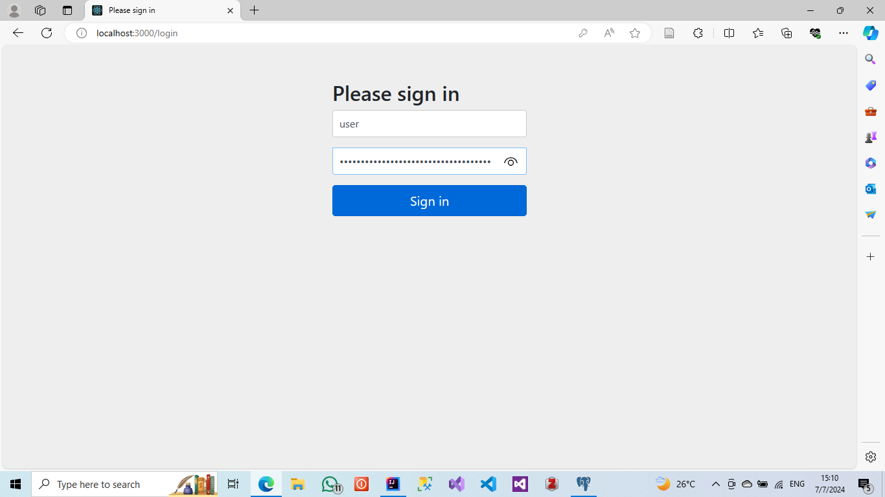
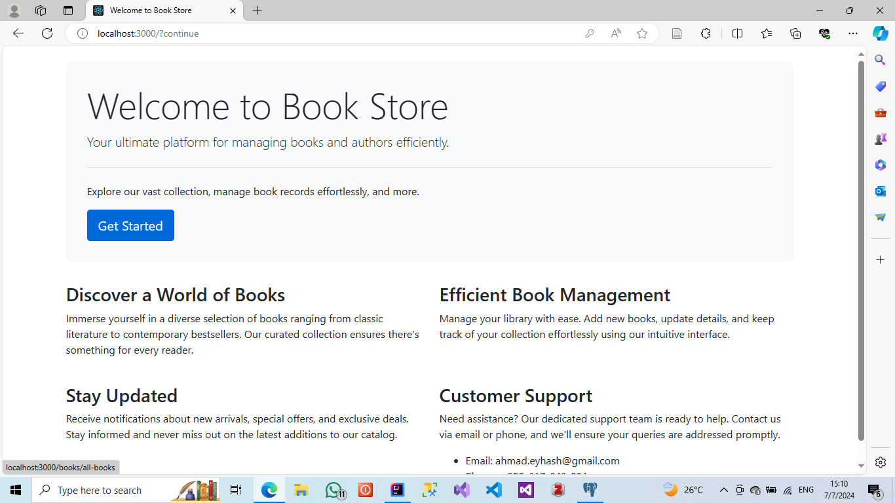
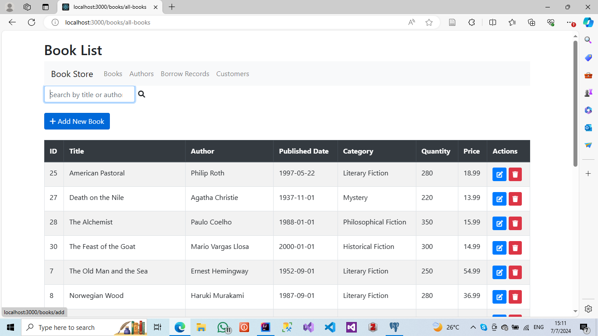
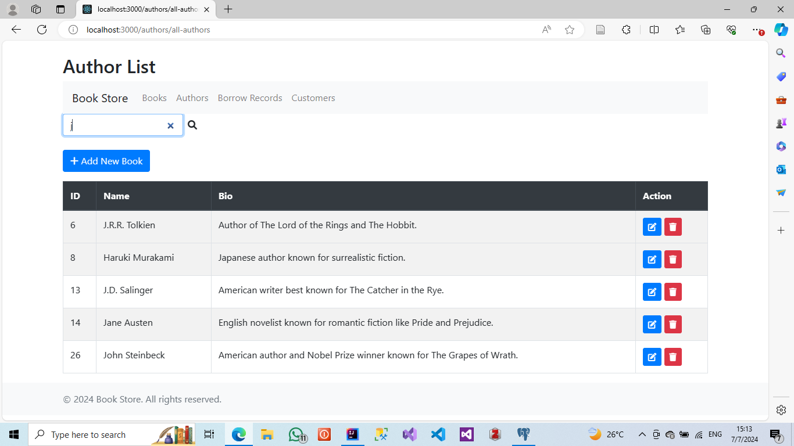
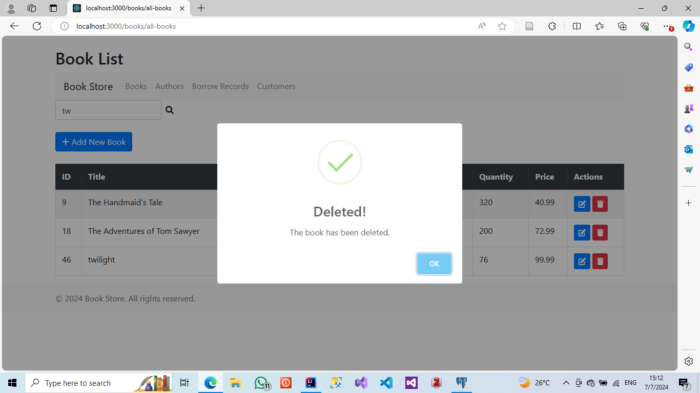
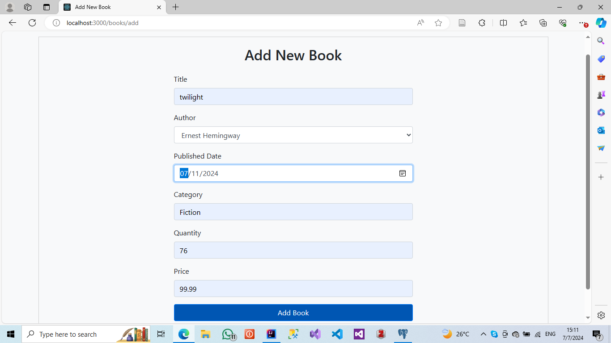

# BookStoreWebApp

BookStoreWebApp is a web application for managing a bookstore. It allows staff to manage books, track borrow records, and handle customer information.

## Features

- **Manage Books**: Add, edit, delete, and view books.
- **Borrow Records**: Track book borrowings and returns.
- **Customer Management**: Add and manage customer information.
- **User Authentication**: Admin and user roles for different access levels.

## Technologies Used

- **Backend**: Spring Boot, Java, PostgreSQL
- **Frontend**: Thymeleaf, Bootstrap
- **Notifications**: SweetAlert

## Screenshots

- Login Page
  

- Home Page
  

- Book List
  

- Authors Page
  
  
  - SweetAlert
  


- Add Book
  

## Getting Started

### Prerequisites

- **Java Development Kit (JDK)**: Version 17 or later.
- **Maven**: To build the project.
- **PostgreSQL**: Database server.
- **Git**: For version control.

### Installation

1. **Clone the Repository**

   ```bash
   git clone https://github.com/MasterWithAhmad/BookStoreWebApp.git
   cd BookStoreWebApp

 ## Set Up the Database

1. **Create a PostgreSQL Database**:
   - Name the database `bookstore`.

2. **Update Database Connection Settings**:
   - Open the `src/main/resources/application.properties` file.
   - Set the database connection properties as follows:
   
   ```properties
   spring.datasource.url=jdbc:postgresql://localhost:5432/your_database_name
   spring.datasource.username=your_db_username
   spring.datasource.password=your_db_password

3. ## Build the Project:
   mvn clean install
   
4. ## Run the Application
   mvn spring-boot:run
## Alternatively, you can run the generated JAR file:
java -jar target/BookStoreWebApp-0.0.1-SNAPSHOT.jar

4. ## Access the Application:
   Open your web browser and go to http://localhost:3000.
